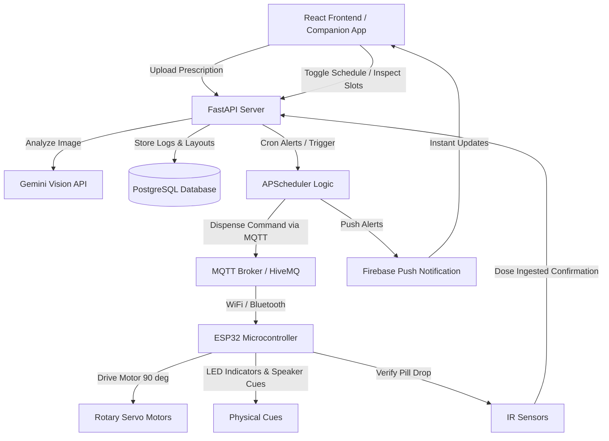

# 💊 PillMate — AI-Powered Smart Medication Companion
> **The Smart AI-Powered Medication Companion for Indian Homes**  

---

## 📝 Introduction
PillMate is an intelligent medication management system designed to simplify the complete medicine journey for elderly users. Instead of acting as just a basic reminder system, PillMate combines artificial intelligence, hardware automation, and accessible, caregiver-connected interaction to reduce confusion, support families, and verify that critical medicines are taken correctly and on time.

---

## 🌟 The Problem
* **Adherence Barriers:** Elderly patients taking multiple daily medications struggle with complex schedules, leading to missed doses or accidental double dosing.
* **Visual Pill Confusion:** Many generic tablets and capsules look visually identical, increasing the risk of dangerous overdosing or duplicate consumption.
* **Lack of Empirical Verification:** Traditional pill organizers only prompt/remind users, but cannot confirm if the pill was actually dispensed and swallowed.
* **Caregiver Disconnection:** Caregivers operate in silos, lacking real-time data on daily patient adherence, leading to high family anxiety.

---

## 🚀 Key Features & Flow
`Upload Prescription` ➡️ `AI Extracts Dosages` ➡️ `Assign Medicine Slots` ➡️ `Generate Schedule` ➡️ `Automated Dispense & Verify`

* 🔍 **AI Prescription Parsing:** Automatically extracts drug names, dosages, frequencies, and instructions from uploaded hand-written or printed prescriptions.
* 📍 **Visual Compartment Mapping:** An interactive drag-and-drop mapping system visualizes a 10-slot circular dispenser tray matching the physical hardware's slots.
* ⚙️ **Automated Scheduled Dispensing:** Releases only the correct medicines at scheduled times, eliminating manual layout sorting errors.
* 🚦 **Empirical Intake Verification:** Uses physical IR tripwire sensors at the dispenser nozzle to count and verify every pill dropped.
* 🗣️ **Local Language Voice Assistant:** Supports interactive voice reminders and verbal confirmations in regional languages.
* 💡 **Ambient LED Guidance System:** Color-coded physical light rings guide the user (Green for safe dispense, Red for alerts, Yellow for upcoming dose).
* 📱 **Real-time Caregiver Alerts:** Pushes instant notifications to caregivers when a critical dose is taken, delayed, or missed.

---

## 🛠️ System Architecture

PillMate is designed as a connected ecosystem composed of a mobile-friendly frontend application, an AI-powered orchestrator backend, and a Wi-Fi/Bluetooth IoT device.



---

## 💻 Tech Stack Details

### 1. Frontend Web Companion App *(Implemented in Repository)*
* **Core Framework:** React 18, Vite, TypeScript
* **Styling & UX:** Tailwind CSS, Lucide icons, responsive mobile-first views
* **State Management:** Zustand (stores for schedules, dispenser status, and medication syncing)
* **Key Screen Mappings:**
  - **Today's Schedule:** Grouped timeline view (Morning, Afternoon, Evening) with large typography, high contrast text alignment, and adherence logs.
  - **Smart Dispenser Status:** Interactive 10-slot circular SVG layout mapping active pill trays, Wi-Fi link status, battery levels, and interactive LED diagnostics.
  - **Prescription Verification:** Summary board showing extracted prescription slot mappings.
  - **Voice Assistant:** Interface indicating voice assistant activity, speech wave visualizers, and speech verification status.

### 2. Backend & AI Orchestration *(Architecture Design)*
* **Server Framework:** FastAPI (Python-based asynchronous API and business logic)
* **Database:** PostgreSQL (storing user credentials, active slot mappings, and compliance logs)
* **Generative AI Vision Module:** 
  - Powered by **Gemini Vision API** (extracting hand-written prescription details automatically using OCR and schema-structured parsing).
  - High availability: Free tier supports up to 1,500 requests/day, making it cost-effective for household scaling.
* **Task Scheduler:** APScheduler (Python rule engine to trigger alerts and manage dose release intervals).
* **Push Services:** Firebase Cloud Messaging (FCM) to trigger alarms and push compliance updates to caregiver phones.

### 3. IoT Hardware & Firmware *(Prototype Design)*
PillMate follows a compact cylindrical bedside design with a transparent UV-protective polycarbonate chamber and an injection-molded ABS outer shell.
* **Microcontroller:** **ESP32** (with Wi-Fi, Bluetooth Low Energy, and RTC for accurate offline time tracking).
* **Dispensing Actuator:** Dual Servo Motors driving a rotating guide plate to isolate and release medications from 10 distinct vertical funnel bays.
* **Intake Verification Sensor:** High-frequency Infrared (IR) emitter-receiver tripwire at the nozzle, detecting drops agnostic of pill weight or size (from 4mm to 20mm tablets).
* **Communication Protocol:** MQTT (via Mosquitto/HiveMQ broker) ensuring low latency command signals sent from the app to the physical dispenser.

---

## 📈 Future Scope & Growth Strategy

### Short-Term
* **Micro-Vibratory Support:** Add an anti-jam vibration motor to ensure smooth release of sticky capsules or odd-shaped tablets.
* **Offline Scheduler Sync:** Implement ESP32 flash storage schedules so medications dispense on time even during WiFi outages.

### Long-Term
* **Wearable Health Sync:** Integrate with fitness bands and smartwatches (such as Fitbit/Apple Watch) to map heart rate, sleep quality, and medication adherence profiles.
* **AI Health Analytics:** Predict disease flare-ups by analyzing correlation profiles between medication adherence deviations and vital wearable metrics.

---

## ⚙️ How to Run the Frontend Web App Locally

### Prerequisites
* **Node.js** (v18.0.0 or higher recommended)
* **npm** (v9.0.0 or higher)

### Setup & Run
1. Navigate to the project directory:
   ```bash
   cd pill-mate-
   ```
2. Install dependencies:
   ```bash
   npm install
   ```
3. Start the development server:
   ```bash
   npm run dev
   ```
